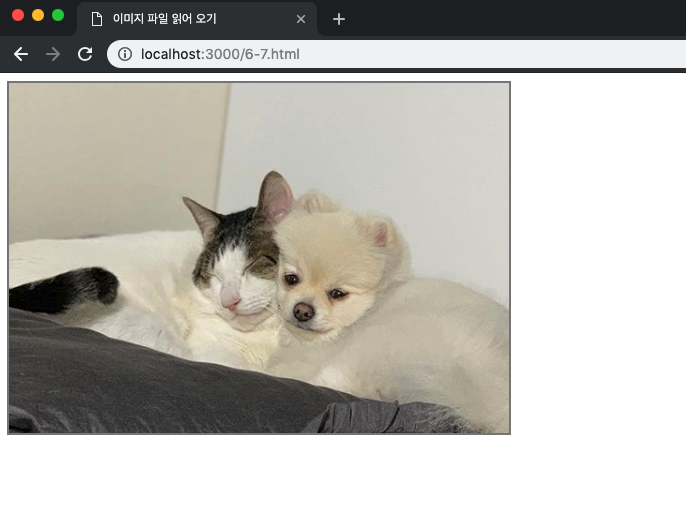
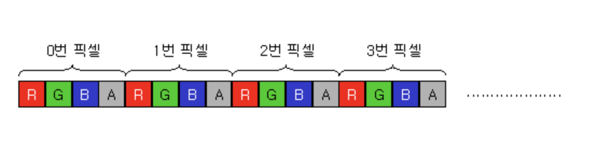

# __6.5 Canvas를 활용한 컴퓨터 그래픽스__
[](https://developer.mozilla.org/ko/docs/Web/HTML/Canvas)
## __6.5.7 그림 읽어 들이기__
- Canvas로 이미지를 표시할 수 있다.
- 이미지 리소스
    - URL이 가리키는 이미지 파일
    - Canvas로 그린 결과
    - Image 객체
    - Video 객체

    #### __[예제 6-7] URL이 가리키는 이미지 파일을 Canvas로 읽어 들이기__
    ```html
    <!DOCTYPE html>
    <html>

    <head>
        <meta charset="UTF-8">
        <title> 이미지 파일 읽어 오기</title>
        <style>
            canvas {
                border: 2px solid gray;
            }
        </style>
        <script>
            window.onload = function() {
                var canvas = document.getElementById("mycanvas");
                var ctx = canvas.getContext('2d');
                var img = new Image(); // (1)

                img.onload = function() {
                    ctx.drawImage(img, 0, 0); // (2)
                };

                img.src = './animal.png';
            };
        </script>
    </head>

    <body>
        <canvas id="mycanvas" width="500" height="350"></canvas>
    </body>

    </html>
    ```
    #### 결과
    

    #### __(1) 이미지 객체를 가져온다__
    ```js 
    var img = new Image();
    img.src = './animal.png';
    // img.src = canvas.toDataURL();
    ``` 
    - 이미지 객체의 scr 속성에 이미지 파일의 URL을 지정
    - toDataURL() 메서드를 사용하면 Canvas에 그린 Image를 base64 기반의 Data URL로 변환

    #### __(2) drawImage 메서드로 이미지 객체의 이미지를 Canvas에 그린다.__
    ```js 
    img.onload = function() {
        ctx.drawImage(img, 0, 0);
    };

    img.src = './animal.png';
    ``` 
    - onload 이벤트를 통해 image가 로드 된 후에 Draw한다.
    - 코드상으로 어떤 쪽을 먼저 선언해도 차이는 없지만 일반적으로 후 처리를 먼저 등록하고 읽기작업 수행
<br><br>
 ### __drawImage 메서드의 다양한 사용법__

```js 
drawImage(img, x, y)
```
- 좌표 점 (x, y)를 왼쪽 위 꼭짓점으로 삼아 Image를 읽어 들인다.
```js 
drawImage(img, x, y, width, heigth)
```
- 좌표 점 (x, y)과 Image의 width, height값
```js 
drawImage(img, sx, sy, sw, sh, x, y, width, height)
```
- 이미지의 원하는 영역을 잘라내서 그릴수 있다.

## __6.5.8 픽셀 제어하기__
- `getImageData` 메서드를 사용하면 Canvas 이미지의 픽셀 값(RGBA)을 제어할 수 있는 imageData 객체를 가져올 수 있으므로 화상 처리가 가능하다.
- 화상 처리 알고리즘 중애는 압축되지 않은 imageData를 사용해야만 하는 알고리즘이 있는데 이를 처리하기 위해서는 `createImageData` 메서드를 사용할 수 있다.
- `putImageData` 메서드를 사용해서 imageData를 핸더링 컨텍스트에 그릴 수 있다.

> ### __getImageData(x, y, width, height)__
```js
var imageData = ctx.getImageData(x, y, width, height);
```
- 속성
    - `imageData.width`: unsigned long형식으로 ImageData의 pixel기준의 실제 가로값입니다.
    - `imageData.height`: unsigned long형식으로 ImageData의 pixel기준의 실제 높이값입니다.
    - `imagaData.data`
        - Uint8ClampedArray형식이며 1차원 배열로 RGBA순서로 정의된 이미지 데이터를 나타내니다. 각 원소는 정수값으로 0에서 255사이의 값을 갖습니다.
        - data는 래스터 정보이다. 래스터 정보는 한 점당 R,G,B,A 요소 각각에 대해 4바이트씩의 값을 가지며 이런 픽셀 정보가 좌에서 우로, 위에서 아래로 나열된다. 이미지 자체는 2차원의 픽셀 배열이지만 래스터 데이터는 1차원의 픽셀 배열이다.
        

#### __[예제 6-8] 픽셀의 RGB값 표시하기__
```html
<!DOCTYPE html>
<html>

<head>
    <meta charset="UTF-8">
    <title>픽셀의 RGB 값</title>
    <style>
        canvas {
            border: 2px solid gray;
        }
    </style>
    <script>
        window.onload = function () {
            var canvas = document.getElementById("mycanvas");
            var ctx = canvas.getContext("2d");
            // 이미지 객체 생성하기
            var img = new Image();
            // 이미지를 읽어 들인 후의 처리
            img.onload = function () {
                // 읽어 들인 이미지를 Canvas에 그리기
                ctx.drawImage(img, 0, 0);
                // ImageData 객체 가져오기
                // (canvas.width와 canvas.height에는 canvas 요소의 가로 폭과 세로 폭이 저장되어 있음)
                var imageData = ctx.getImageData(0, 0, canvas.width, canvas.height);
                // RGBA 값을 구하는 메서드를 추가
                imageData.getRGBA = function (m, n, i) {
                    return this.data[this.width * 4 * n + 4 * m + i];
                };
                var rgb = document.getElementById("rgb");
                // canvas 요소를 클릭했을 때의 처리
                canvas.onclick = function (event) {	// event는 이벤트 객체
                    var x = event.offsetX; // 마우스로 클릭한 위치의 X좌표
                    var y = event.offsetY; // 마우스로 클릭한 위치의 Y좌표
                    rgb.innerHTML = " R:" + to3digit(imageData.getRGBA(x, y, 0))
                        + " G:" + to3digit(imageData.getRGBA(x, y, 1))
                        + " B:" + to3digit(imageData.getRGBA(x, y, 2));
                };
            };
            img.src = "./dog.png";
        };
        // 숫자를 3자리 문자열로 변환하는 함수
        function to3digit(n) {
            return ("000" + n).slice(-3);
        }
    </script>
</head>

<body>
    <canvas id="mycanvas" width="640" height="400"></canvas>
    <div>
        <output id="rgb"></output>
    </div>
</body>

</html>
```
> ### __createImageData 메서드__
- createImageData(width, height)
    - 너비 width, 높이 height를 갖는 imageData 객체를 생성
    - 초기 픽셀은 투명한 검은색
- createImageData(anotherImageData)
    - anotherImageData와 크기가 같은 이미지를 담을 수 있는 imageData 객체를 생성한다,
    - anotherImageData 내부 데이터는 복사되지 않는다.
    - 초기 픽셀은 마찬가지로 투명한 검은색
> ### __putImageData 메서드__
```js
ctx.putImageData(imageData, x, y);
```
- 렌더링 컨텍스트 위에 그릴 이미지의 왼쪽 위 모서리의 좌표는 (x, y)


## __살펴볼 문헌__
- 이미지 데이터
http://www.soen.kr/html5/html3/3-2-2.htm
- createImageData https://developer.mozilla.org/en-US/docs/Web/API/CanvasRenderingContext2D/createImageData
- 책에서는 맛볼 수 없는 HTML5 Canvas 이야기 https://www.slideshare.net/deview/122-html5-canvas


# __WebGL__
## __정의__
- 인터넷 브라우저 환경에서 OpenGL을 플러그인 도움 없이 공식적으로 사용할 수 있도록 Khronos Group에서 제정한 웹 그래픽스 API.
- 도입된 이후 급 부상하여 거의 대부분의 브라우저에서 지원하기 시작했으며, 2017년 이후로 하나둘씩 WebGL 2.0을 적용하기 시작했다. 웹 표준은 아니지만, 거의 표준처럼 인식되어 가고 있다.
- OpenGL: 1992년 실리콘 그래픽스사에서 만든 2차원 및 3차원 그래픽스 표준 API 규격

## __기본적인 렌더링__
```html
<!DOCTYPE html>
<html>

<head>
    <meta charset="UTF-8">
    <title>WebGL 예제</title>
    <style>

    </style>
    <script>
        var gl; // A global variable for the WebGL context

        function start() {
            var canvas = document.getElementById("glcanvas");

            gl = initWebGL(canvas);      // Initialize the GL context

            // Only continue if WebGL is available and working
            if (gl) {
                gl.clearColor(0.0, 0.0, 0.0, 1.0);                      // Set clear color to black, fully opaque
                gl.enable(gl.DEPTH_TEST);                               // Enable depth testing
                gl.depthFunc(gl.LEQUAL);                                // Near things obscure far things
                gl.clear(gl.COLOR_BUFFER_BIT | gl.DEPTH_BUFFER_BIT);      // Clear the color as well as the depth buffer.
            }
        }

        function initWebGL(canvas) {
            gl = null;

            try {
                // Try to grab the standard context. If it fails, fallback to experimental.
                gl = canvas.getContext("webgl") || canvas.getContext("experimental-webgl");
                alert("WebGL 렌더링 준비 완료!");
            }
            catch (e) { }

            // If we don't have a GL context, give up now
            if (!gl) {
                alert("Unable to initialize WebGL. Your browser may not support it.");
                gl = null;
            }

            return gl;
        }
    </script>
</head>

<body onload="start()">
    <canvas id="glcanvas" width="640" height="480">
        Your browser doesn't appear to support the HTML5 <code>&lt;canvas&gt;</code> element.
    </canvas>
</body>

</html>
```
## __사용 예__
- 액체 시물레이션 http://david.li/fluid/
- 광선 추적 http://madebyevan.com/webgl-path-tracing/

- WebGL로 3D 객체 만들기
https://developer.mozilla.org/ko/docs/Web/API/WebGL_API/Tutorial/Creating_3D_objects_using_WebGL
- WebGL 예제
https://webglsamples.org/
- 쉽게 풀어보는 WebGL https://www.slideshare.net/hanmomhanda/web-gl-42962918