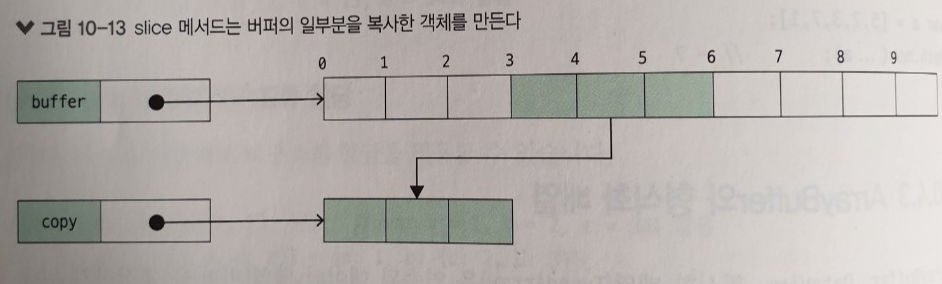
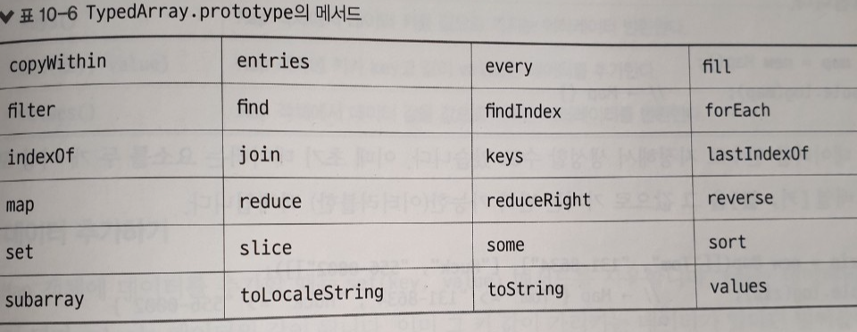
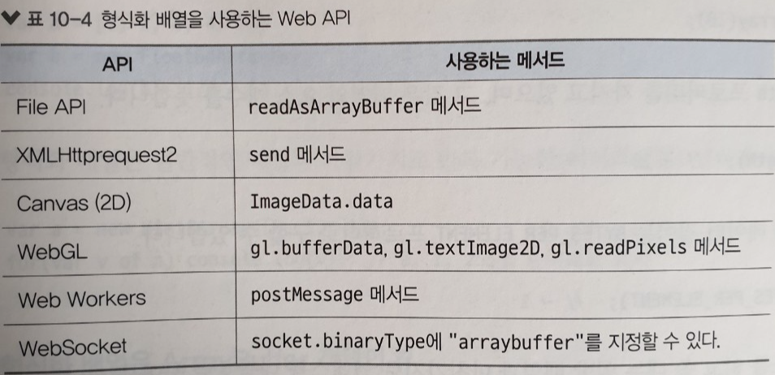
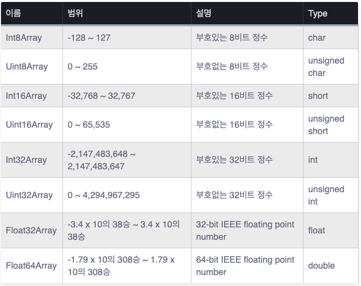

# __10.3 유사 배열 객체__

자바스크립트에서는 배열은 아니지만 배열로 처리할 수 있는 객체를 다양한 상황에서 사용한다. 이 절에서는 이런 '유사 배열 객체(Array-like object)'를 살펴본다.

## __10.3.1 유샤 배열 객체__
자바스크립트에서의 배열이란 곧 Array 타입의 객체를 말한다. 기본적으로 사용하는 Array 타입의 객체의 특징은 다음과 같다.

- 0 이상의 정수값을 프로퍼티 이름으로 갖는다.
- length 프로퍼티가 존재하며, 요소를 추가 삭제하면 length 프로퍼티 값도 변경된다.
- Array.prototype의 메서드를 상속받아서 사용가능.

위와 같은 성질 중애서 프로퍼티 이름이 0 이상의 정수이고, length 프로퍼티가 있는 객체는 대부분 배열로 다룰 수 있다. 이러한 객체를 `유사 배열 객체`라고 한다.

유사 배열 객체는 Array.prototype의 메서드를 사용할 수 없다. 그러나 배열로 참조하거나 대입할 수 있으며 for 문이나 for/in 문으로 반복처리가 가능히디.

### __유사 배열 객체의 예__
- 함수의 인수를 저장한 [Arguments 객체](https://developer.mozilla.org/ko/docs/Web/JavaScript/Reference/Functions/arguments)
- DOM의 `document.getElementsByName` 메서드, `document.getElementsByName` 메서드 등이 반환하는 [NodeList 객체](https://www.w3schools.com/code/tryit.asp?filename=G4MH912XH8R0)

### __유사 배열 직접 생성하기__
```js
var a = {};
for(var i =0; i < 10; i++) {
    a[i] = i;
}

a.length = 10;

for(var i = 0; sum = 0; i< a.length; i++) {
    sum += a[i];
}
```

## __10.3.2 Array.prototype의 메서드를 유사 배열 객체에서 사용하기__
유사 배열 객체는 Array.prototype의 메서드를 직접 사용할 수 없다. 그러나 prototype.call을 사용하여 간접 호출하면 사용할 수 있다.

```js
var a = {
    0: 1,
    1: 2,
    length: 2
};

Array.prototype.slice.call(a, 0); // ['A', 'B'] 진짜 배열로 변환
Array.prototype.map.call(a, (v => v * v)); // [1, 4]
```

# __ES6의 배열과 새롭게 추가된 기능__
## __10.4.1 비구조화 할당__
`비구조화 할당(Destructuring)`은 배열, 객체, 반복 가능 객체에서 값을 꺼내어 그 값을 별도의 변수에 대입하는 문장이다. 객체의 타입별로 비구조화 할당을 살펴본다.

> ## __1. 배열의 비구조화 할당__
### __기본적인 사용법__
```js
var [a, b] = [1, 2]; // var a = 1, b = 2;

[a, b] = [2*a, 3*b]; // a = 2*a, b = 3*b;

[a, b] = [b, a]; // a값과 b값을 교환함

[a, b, c] = [1, 2]; // a = 1, b = 2, c = undefined;

[,a , , b] = [1, 2, 3, 4]; // a = 2, b = 4;
```

### __나머지 요소__
```js
[a, b, ..rest] = [1, 2, 3, 4]; // a = 2, b = 2, rest = [3, 4];
```

### __요소의 기본값__
```js
[a=0, b=1, c=2] = [1, 2]; // a = 1, b = 2, c = 2;
```

### __함수가 배열로 반환한 값을 비구조화 할당받기__
```js
function rotation(x, y, theta) {
    var s = Math.sin(theta), c = Math.cos(theta);
    return [c*y - s*y, s*x + c*y];
}

var [a, b]= ratation(1, 2, Math.PI/3);
```
> ## __2. 객체의 비구조화 할당__
### __기본적인 사용법__
```js
var {a: x, b: y} = {a: 1, b: 2}; // x = 1, y = 2;

{a: x, b: y} = {a: 1, c: 2} // x = 1, y = undefined;
```
### __프로퍼티의 기본값__
```js
{a: x=1, b: y=2, c: z=3} = {a: 2, b: 4}; // x = 2, y = 4, z = 3;
```

### __프로퍼티 이름 생략하기__
```js
{a, b} = {a: 1, b: 2}; // {a: a, b: b} = {a: 1. b: 2};
```

### __Iterable 객체와 비구조화 할당__
```js
var [a, b, c] = 'ABC';
function* createNumbers(from, to) {
    while(from <= to) {
        yield from++;
    }
}

var [a, b, c, d, e] = createNumber(10, 15);
// a = 10, b = 11, c = 12, d = 13, e = 14;
```

### __중첩된 자료 구조의 비구조화 할당__
```js
var [a, [b, c]] = [1, [2, 3]];
```

## __10.4.2 전개 연산자__
...은 전개 연산자(spread operator)라고 한다. 전개 연산자는 반복가능한 객체를 반환하는 표현식 앞에 표기하며, 이를 통해 반복 가능한 객체를 배열 리터럴 또는 함수의 인수 목록으로 펼칠 수 있다.

```js
[...'ABC'] // ['A', 'B', 'C']

f(...[1, 2, 3]) // f(1, 2, 3)
```

보통 배열을 합칠때 Array.prototype.concat 메서드를 사용하는데, 전개 연산자를 활용하면 Array.prototype.push 메서드로도 배열을 연결할 수 있다.

```js
var arr = ['A', 'B', 'C'];
arr.concat(['D', 'E'])

var arr = ['A', 'B', 'C'];
arr.push(...['D', 'E'])
```

다음은 배열안의 최대값을 [Math.max](https://developer.mozilla.org/ko/docs/Web/JavaScript/Reference/Global_Objects/Math/max)로 구한다.
```js
var arr = [1, 2, 3, 4];
Math.max(...arr); // 4
```

## __10.4.3 ArrayBuffer와 형식화 배열__
- ArrayBuffer, DataVuew, 형식화 배열(TypedArray)은 연속된 데이터 영역(버퍼)를 조작하기 위핸 만들어진 객체이다.
- 이들을 활용하면 배열과 이미지 데이터를 빠르게 읽고 쓸 수 있다.
- 원래 웹 브라우저의 WebGL을 사용하여 3차원 그래픽을 구현할 용도록 만들어졌다.
- ArrayBuffer는 버퍼를 확보하고, DataVuew와 TypedArray는 버퍼에 뷰를 제공
- 이 절에서는 ArrayBuffer와 형식화 배열을 살펴본다.

### __ArrayBuffer 생성자__
- ArrayBuffer 생성자는 메모리에 고정 길이를 가진 인접한 버펴를 확보한다.
- 영역을 확보하는 역할만 할 뿐 버퍼를 조작하는 메서드는 제공하지 않음
- 버퍼를 조작하기 위해서는 TypedArray 또는 DataView 객체를 이용 해야한다.
- 만들어진 버퍼의 크기는 `byteLength` 프로퍼티로 구할 수 있으며 단위는 바이트이다.
    ```js
    //메모리에 1024바이트의 버퍼(Arraybuffer)를 만드는 코드

    var buffer = new ArrayBuffer(1024);

    console.log(buffer.byteLength) // 1024
    ``` 
- ArrayBuffer.Prototype에는 slice매서드 존재하여 사용가능
    ```js
    var copy = buffer.slice(3, 6);
    ```
    

### __형식화 배열__
- 자바스크립트 배열은 Array 객체이고 다양한 메서드를 이용할 수 있어 편리하지만 배열 요소를 읽고 쓰는 속도가 느리다는 단점이 있다.
- TypedArray는 ArrayBuffer가 확보한 버퍼를 데이터의 저장 장소로 이용하여 데이터의 빠른 읽기와 쓰기를 구현한 객체이다. 이를 사용하면 텍스트나 파일을 바이트 형태로 전송할 수 있다.
- WebRTC나 WebSocket 의 경우 파일을 Base64 형태의 문자열로 변환하여 보낼 수도 있으나 이럴 경우 대용량 파일이 문제가 된다. 어마어마한 양의 Base64 문자열을 안정적으로 핸들링하기가 여간 어려운것이 아니다. 이와 같은 경우 파일을 바이트로 변환하여 송수신할 수 있다.
- Array 객체인 일반 배열과의 차이점
    - 형식화 배열의 요소는 제한적이며 요소를 추가하거나 삭제할 수 없다.
    - Array.prototype 메서드 이용 불가하지만 TypedArray.prototype 메서드 이용 가능
    
    - 형식화 배열을 생성하면 모든 요소가 0으로 초기화

형식화 배열을 사용하는 Web API는 다음과 같다.
    

### __형식화 배열의 생성__
형식화 배열은 형식화 배열 요소가 차지하는 비트에 따라 아홉 종류로 구분할 수 있다. 각각의 형식화 배열은 아래의 생성자로 구분 할 수 있다.


```js
var buffer = new ArrayBuffer(100);
var a = Int16Array(buffer);
console.log(a.length); // 50
```
buffer의 데이터 길이는 100바이트이며, Int16Array로 생성한 배열의 요소 하나의 데이터 길이는 2바이트이다. 따라서 배열 a의 데이터 길이는 100 / 2 = 50이 된다.

### __형식화 배열은 ArrayBuffer 객체의 뷰__
### __오프셋을 지정해서 형식화 배열 생성하기__
```js
var buffer = new ArrayBuffer(16);
var a = Int16Array(buffer, 2, 5);

console.log(a.byteOffset); // 형식화 배열 시작위치 2

//  객체 하나에 변수 여러개를 배치하여 복합 자료구조로 활용가능
buffer = new ArrayBuffer(24);
var person = {
    id: new Unit32Array(buffer, 0, 1),
    name: new Unit8Array(buffer, 4, 16),
    weight: new Float32Array(buffer, 20, 1)
}
```

## __10.4.4 Map__
ECMAScript 6에서 값들을 매핑하기 위한 새로운 데이터 구조를 소개 하고 있다.  그중 하나인 Map객체는 간단한 키와 값을 서로 연결(매핑)시켜 저장하며 저장된 순서대로 각 요소들을 반복적으로 접근할 수 있도록 한다. 

다음 코드는 Map이 제공하는 기본적인 기능들을 보여 주고 있다. Map객체에 저장되어 있는 각 요소들을 [키, 값] 형태의 배열로 반복적으로 반환해주는 for...of 를 사용할 수 있다.

```js
var sayings = new Map();
sayings.set("dog", "woof");
sayings.set("cat", "meow");
sayings.set("elephant", "toot");
sayings.size; // 3
sayings.get("fox"); // undefined
sayings.has("bird"); // false
sayings.delete("dog");

for (var [key, value] of sayings) {
  console.log(key + " goes " + value);
}
// "cat goes meow"
// "elephant goes toot"
```

### __Object와 Map의 차이점__
전통적으로 objects 는 문자열을 값에 매핑하는 데 사용되었다. Object는 키를 값으로 설정하고, 값을 검색하고, 키를 삭제하고, 키에 저장된 내용을 검색 할 수 있게 만들어준다. 그러나 Map 객체는 더 나은 몇 가지 장점을 가지고 있다.

- Object의 키는 Strings이며, Map의 키는 모든 값을 가질 수 있다.
- Object는 크기를 수동으로 추적해야하지만, Map은 크기를 쉽게 얻을 수 있다.
- Map은 삽입된 순서대로 반복된다.
- 객체(Object)에는 prototype이 있어 Map에 기본 키들이 있다. (이것은 map = Object.create(null) 를 사용하여 우회할 수 있다. )

### __Object와 Map중 어느 것을 사용할지를 결정하는 두가지 팁__
- 실행 시까지 키를 알수 없고, 모든 키가 동일한 type이며 모든 값들이 동일한 type일 경우에는 objects를 대신해서 map을 사용해라. 
- 각 개별 요소에 대해 적용해야 하는 로직이 있을 경우에는 objects를 사용해라. 

### __Map 객체의 메서드__
> Map.prototype.clear()

Map 객체의 모든 key/value pair를 제거한다.

> Map.prototype.delete(key)

주어진 키(Key)와 해당되는 값(Value)를 제거하고 제거하기 전에 Map.prototype.has(key)가 반환했던 값을 반환한다. 그 후의 Map.prototype.has(key)는 false를 반환한다.

> Map.prototype.entries()

Map 객체 안의 모든 요소들을 [key, value] 형태의 array 로 집어넣은 순서대로 가지고 있는 Iterator 객체를 반환한다.

> Map.prototype.forEach(callbackFn[, thisArg])

Map 객체 안에 존재하는 각각의 key/value pair에 집어넣은 순서대로 callbackFn을 부른다. 만약 thisArg 매개변수가 제공되면, 이것이 각 callback의 this 값으로 사용된다.

>Map.prototype.get(key)

주어진 키(Key)에 해당되는 값(value)을 반환하고, 만약 없으면 undefined를 반환한다.

>Map.prototype.has(key)

Map 객체 안에 주어진 key/value pair가 있는지 검사하고 Boolean 값을 반환한다.

>Map.prototype.keys()

Map 객체 안의 모든 키(Key)들을 집어넣은 순서대로 가지고 있는 Iterator 객체를 반환한다.

>Map.prototype.set(key, value)

Map 객체에 주어진 키(Key)에 값(Value)를 집어넣고, Map 객체를 반환한다.

>Map.prototype.values()

Map 객체 안의 모든 값(Value)들을 집어넣은 순서대로 가지고 있는 Iterator 객체를 반환한다.

>Map.prototype[@@iterator]()

Map 객체 안의 모든 요소들을 [key, value] 형태의 array 로 집어넣은 순서대로 가지고 있는 Iterator 객체를 반환한다.

## __10.4.4 Set__
- Set 객체는 중복되지 않는 유일한 데이터를 수집하여 활용하기 위한 객체이다.
- 삽입 순서대로 요소를 순회할 수 있고, 하나의 Set 내 값은 한 번만 나타날 수 있다. 
- 값의 데이터 타입에는 제한이 없고 객체타입과 원시타입 모두 가능

### __Set 객체 사용__
```js
var mySet = new Set();

mySet.add(1); // Set { 1 }
mySet.add(5); // Set { 1, 5 }
mySet.add(5); // Set { 1, 5 }
mySet.add('some text'); // Set { 1, 5, 'some text' }

var o = {a: 1, b: 2};
mySet.add(o);

mySet.add({a: 1, b: 2}); // o와 다른 객체를 참조하므로 괜찮음

mySet.has(1); // true
mySet.has(3); // false, 3은 set에 추가되지 않았음
mySet.has(5);              // true
mySet.has(Math.sqrt(25));  // true
mySet.has('Some Text'.toLowerCase()); // true
mySet.has(o); // true

mySet.size; // 5

mySet.delete(5); // set에서 5를 제거함
mySet.has(5);    // false, 5가 제거되었음

mySet.size; // 4, 방금 값을 하나 제거했음
console.log(mySet);// Set {1, "some text", Object {a: 1, b: 2}, Object {a: 1, b: 2}}
```

### __Set 객체의 메서드__
>Set.prototype.add(value)

Set 객체에 주어진 값을 갖는 새로운 요소를 추가합니다. Set 객체를 반환합니다.

>Set.prototype.clear()

Set 객체에서 모든 요소를 제거합니다.

>Set.prototype.delete(value)

value와 관련된 요소를 제거하고 Set.prototype.has(value)가 이전에 반환했던 값을 반환합니다. Set.prototype.has(value)는 그 뒤에 false를 반환합니다.

> Set.prototype.entries()

삽입 순으로 Set 객체 내 각 값에 대한 [value, value] 배열을 포함하는 새로운 Iterator 객체를 반환합니다. 이는 Map 객체와 비슷하게 유지되므로 여기서 각 항목은 그 key와 value에 대해 같은 값을 갖습니다.

>Set.prototype.forEach(callbackFn[, thisArg])

삽입 순으로 Set 객체 내에 있는 각 값에 대해 한 번 callbackFn을 호출합니다. thisArg 매개변수가 forEach에 제공된 경우, 이는 각 콜백에 대해 this 값으로 사용됩니다.

>Set.prototype.has(value)

Set 객체 내 주어진 값을 갖는 요소가 있는지를 주장하는(asserting, 나타내는) boolean을 반환합니다.

>Set.prototype.keys()

values() 함수와 같은 함수로 삽입 순으로 Set 객체 내 각 요소에 대한 값을 포함하는 새로운 Iterator 객체를 반환합니다.

>Set.prototype.values()

삽입 순으로 Set 객체 내 각 요소에 대한 값을 포함하는 새로운 Iterator 객체를 반환합니다.

>Set.prototype[@@iterator]()

삽입 순으로 Set 객체 내 각 요소에 대한 값을 포함하는 새로운 Iterator 객체를 반환합니다.