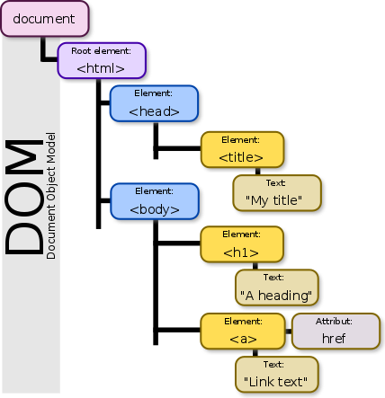
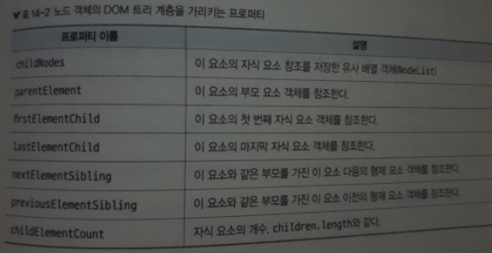
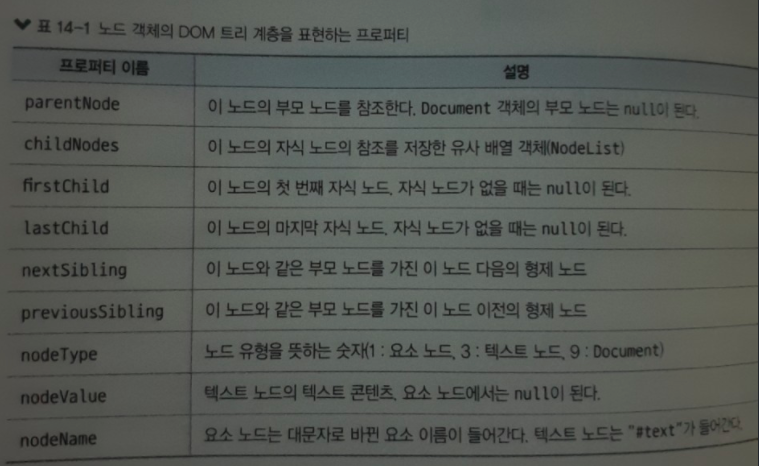
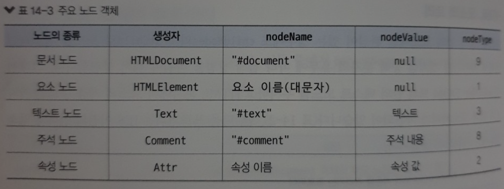
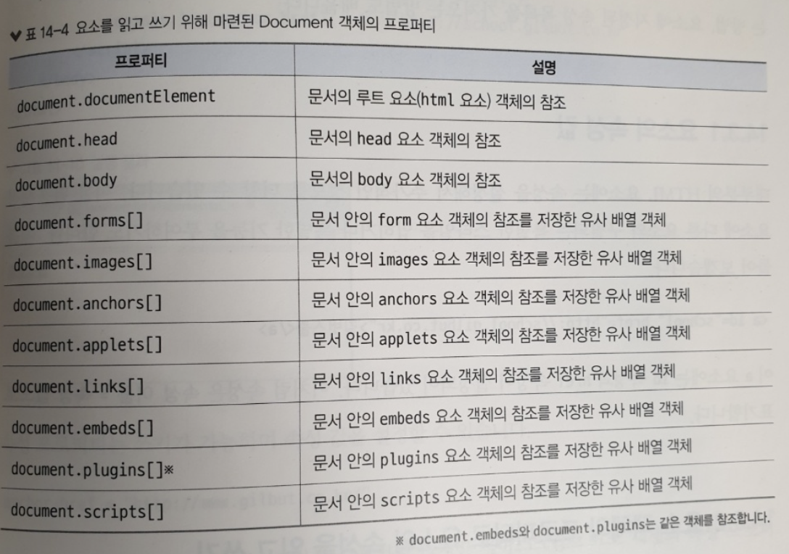
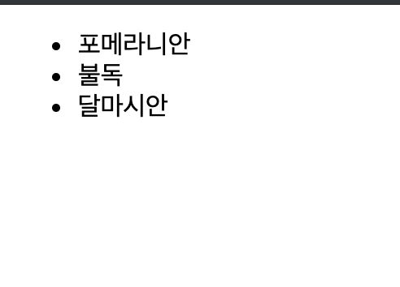

# __14.1 DOM 트리__
문서를 제어하는 API인 DOM(Document Object Model)의 개요를 설명한다. 이후 DOM의 다양한 API를 사용하여 HTML 요소를 삽입하고 삭제하는 방법, CSS 스타일을 변경하는 방법등을 배우기 위한 기초 지식들을 이 절에서 알아본다.

## __14.1.1 DOM 트리__
- DOM 트리는 HTML 문서 안의 요소와 텍스트 사이의 포함 관계를 표현
- 웹페이지의 내용은 Document 객체가 관리한다.
- 웹브라우저가 웹페이지를 읽어들인다 -> 랜더링 엔진이 HTML 문서 구문을 해석 -> 객체의 트리구조를 생성(DOM 트리)
- DOM 트리를 구성하는 객체 하나를 노드(Node)라고 한다.
- 노드의 종류
    - `문서노드`: 전체 문서를 가리키는 Document 객체
    - `HTML 요소 노드`: HTML 요소를 가리키는 객체 (요소 객체)
    - `텍스트 노드`: 텍스트를 가리키는 객체(텍스트 객체)
    - `공백 노드`: 공백 문자만으로 구성된 텍스트노드



- HTML은 공백, 탭, 줄바꿈문자를 무시하지만 DOM트리는 요소 앞뒤에 공백문자를 발견하면 텍스트로 취급하여 텍스트 노드를 생성한다. ( = [공백 노드](https://www.w3schools.com/code/tryit.asp?filename=G5AJX8NALKOK))


## __14.1.2 노드 객체의 프로퍼티__

- 노드가 가진 이러한 프로퍼티를 활용하면 Document 객체를 타고 내려가 특정 요소 객체나 텍스트 객체를 참조 할 수 있다.

### __HTML 요소의 트리__


### __주요 노드 객체__

```js
console.log(document.constructor); // ->  ƒ HTMLDocument() { [native code] }
console.log(document.nodeName, document.nodeValue, document.nodeType); // -> #document null 9

var element = document.children[0].children[1].firstElementChild;
console.log(element.constructor); // -> ƒ HTMLScriptElement() { [native code] }
console.log(element.nodeName, element.nodeValue, element.nodeType); // -> SCRIPT null 1
```


## __14.1.3 자바스크립트로 웹 페이지 제어하기__
- 자바스크립트를 사용하여 DOM트리 및 스타일규칙을 제어할 수 있다.
- 렌더링 엔진은 DOM 트리와 스타일 규칙이 바뀔 때마다 [렌더트리](https://heowc.tistory.com/83)를 다시 구성해서 웹 페이지를 다시 그린다.
- 랜더트리 생성을 위한 계산(reflow)과 다시 그리는 작업(repaint)이 자주 발생하면 랜더링이 원할하지 않게된다. [-> 성능 저하 최소화 시켜야함](https://github.com/wonism/TIL/blob/master/front-end/browser/reflow-repaint.md)
- CRP 관련영상
    - [The Render Tree - Website Performance Optimization](https://www.youtube.com/watch?v=lvb06W_VKVE)
    - [TECH CONCERT: FRONT END 2019 - 오늘부터 나도 FE 성능분석가](https://www.youtube.com/watch?v=cpE1dwJgS4c)
    - [css reflow visialization](https://www.youtube.com/watch?v=9-ezi9pzdj0)


# __14.2 노드 객체 가져오기__
- 자바스크립트로 HTML 요소를 제어하려면 그 전에 제어하고자 하는 요소 객체를 먼저 가져와야한다. 
- Document 객체를 참조하여 타고 내려가서 참조하는 방법도 있지만 더 효율적으로 객체를 가져오는 방법이 있다.

## __14.2.1 id 속성으로 노드 가져오기__
> __document.getElementById(id 값);__

[예제 14-2-1] 요소의 내용을 바꾸기
```js
<!DOCTYPE html>
<html lang="ko">
    <head>
        <meta charset="UTF-8">
    </head>
    <body>
        <div id="first">첫 번째 div</div>
        <div id="second">두 번째 div</div>
        <div id="third">세 번째 div</div>
        <script>
            var element = document.getElementById("second");
            console.log(element); //<div id="second">두 번째 div</div>
            element.innerHTML = "여기를 수정함"; // 두 번째 div 요소의 내용을 수정한다
        </script>
    </body>
</html>
```

## __14.2.2 요소의 이름으로 노드 가져오기__
> __document.getElementsByTagName(요소의 태그 이름);__

[예제 14-2-2] 문서 안의 모든 div 요소 가져오기
```html
<!DOCTYPE html>
<html lang="ko">
    <head>
        <meta charset="UTF-8">
    </head>
    <body>
        <div>첫 번째 div</div>
        <div>두 번째 div</div>
        <div>세 번째 div</div>
        <script>
            var elements = document.getElementsByTagName("div");
            console.log(elements); // HTMLCollection(3) [div, div, div]
            elements[2].innerHTML = "여기를 수정함"; // 세 번째 div 요소의 내용을 수정한다
        </script>
    </body>
</html>
```

> __NodeList 객체__
- 현재 getElementsByTagName, getElementsByClassName은 HTMLCollection 타입의 객체를 반환하는것으로 스펙이 변경됨
- [라이브 컬렉션](https://developer.mozilla.org/ko/docs/Web/API/NodeList): DOM의 변경 사항을 실시간으로 콜렉션에 반영
- NodeList 객체를 순회하면서 요소를 추가하거나 라이브 컬렉션의 특징을 사용하지 않아야 하는경우 객체의 복사본을 만들어서 사용해야한다.
    ```js
    var divs = document.getElementsByTagName("div");
    var staticList = Array.prototype.slice.call(divs, 0)
    ```

## __14.2.3 class 속성 값으로 노드 가져오기__
> __document.getElementsByClassName(class의 이름);__

```html
<!DOCTYPE html>
<html lang="ko">
    <head>
        <meta charset="utf-8">
    </head>
    <body>
        <div class="cat black">봄베이</div>
        <div class="cat white">페르시안</div>
        <div class="dog white">스피츠</div>
        <script>
            var cats = document.getElementsByClassName("cat"); 
            // -> HTMLCollection(2) [div.cat.black, div.cat.white]
            for(var i=0; i<cats.length; i++) {
                console.log(i + " 번째 고양이 :  " + cats[i].innerHTML);
            }
        </script>
    </body>
</html>
```

## __14.2.4 name 속성 값으로 노드 가져오기__
> __document.getElementsByName(name 속성 값);__

```html
<!DOCTYPE html>
<html lang="ko">
    <head>
        <meta charset="UTF-8">
    </head>
    <body>
        <form>
            <input type="checkbox" name="dog" value="pome">포메라니안<br>
            <input type="checkbox" name="dog" value="dalma">달마시안<br>
            <input type="checkbox" name="dog" value="bool">불독<br>
        </form>
        <script>
            var dogs = document.getElementsByName("dog");
            dogs[1].value = "corgi";
            dogs[1].nextSibling.nodeValue = "웰시 코기";
            for(var i=0; i<dogs.length; i++) {
                console.log(i + " 번째의 값 :  " + dogs[i].value);
            }
        </script>
    </body>
</html>
```

## __14.2.5 css [선택자](https://www.codingfactory.net/10791)로 노드 가져오기__
> __document.querySelectorAll("선택자");__
- NodeList 반환
- 다른 메서드들이 반환하는 NodeList와는 다르게 라이브 콜렉션이 아니다. -> HTML 문서의 내용이 바뀌어도 querySelectorAll 메서드가 반환한 NodeList는 바뀌지 않는다.

```html
<p class="subtitle">
    <span id="1"></span>
    <span id="2"></span>
    <span></span>
    <div></div>
</p>
```

```js
var elements = document.querySelectorAll("p.subtitle > span");

/* 
    NodeList(3) [span#2, span#4, span]
    0: span#2
    1: span#4
    2: span
    length: 3
    __proto__: NodeList 
*/
```
- class 속성값이 subtitle인 p 요소의 직계 자식 요소인 span 요소가 담긴 NodeList를 반환한다.


> __document.querySelector("선택자");__
- 지정한 선택자와 일치하는 요소 객체 중에서 문서 위치가 첫 번째인 요소 객체를 반환

```html
<p class="subtitle">
    <span id="1"></span>
    <span id="2"></span>
    <span></span>
    <div></div>
</p>
```

```js
var elements = document.querySelector("p.subtitle > span");

/* 
    NodeList(3) [span#2, span#4, span]
    0: span#2
    1: span#4
    2: span
    length: 3
    __proto__: NodeList 
*/
```
- class 속성값이 subtitle인 p 요소의 직계 자식 요소 중 첫 번째 span요소를 반환

## __14.2.6 Document 객체의 프로퍼티__



# __14.3 속성 값의 읽기와 쓰기__
요소의 속성값을 읽고 쓰는 방법을 배운다. 요소의 속성 값은 요소 객체의 프로퍼티 또는 요소 객체의 메서드로 읽고 쓸 수 있다. 또한 속성 유무를 확인하고 삭제 하는 방법등을 살펴본다.

## __14.3.1 요소의 속성 값__
대부분의 HTML요소에는 속성을 설정해서 추가적인 정보를 더할 수 있다. 이를 활용해서 요소에 다른 요소와 구별되는 특별한 스타일을 입히거나 특별한 기능을 부여하기도 한다.

```html
<a id="link" href="https://www.naver.com/">네이버 링크</a>
```
a 요소에는 id 속성과 href 속성이 설정되어 있다. 이와같이 `속성 이름 = 속성 값` 으로 표시 한다.

## __14.3.2 요소 객체의 프로퍼티로 요소의 속성을 읽고 쓰기__
```js
<!DOCTYPE html>
<html lang="ko">
    <head>
        <meta charset="UTF-8">
    </head>
    <body>
        <a id="school" href="http://school.gilbut.co.kr">길벗스쿨</a>
        <script>
            var anchor = document.getElementById("school");
            console.log(anchor.href);
        </script>
    </body>
</html>
```

## __14.3.4 속성 값 설정하기__
>요소 객체.setAttribute(속성 이름, 속성 값)
```js
<!DOCTYPE html>
<html lang="ko">
    <head>
        <meta charset="UTF-8">
    </head>
    <body>
        <a id="school" href="http://school.gilbut.co.kr">길벗스쿨</a>
        <script>
            var anchor = document.getElementById("school");
            anchor.setAttribute("href", "http://www.gilbut.co.kr/");
            console.log(anchor);
        </script>
    </body>
</html>
```

## __14.3.5 속성이 있는지 확인하기__
>요소 객체.hasAttribute(속성 이름)

## __14.3.6 속성 삭제하기__
>요소 객체.removeAttribute(속성 이름)

## __14.3.7 전체 속성의 목록 가져오기__
>attributes
```html
<!DOCTYPE html>
<html lang="ko">
    <head>
        <meta charset="UTF-8">
    </head>
    <body>
        <p id="controls">
            <input type="button" value="click" onclick="doSomething();">
        </p>
        <script>
            var para = document.getElementById("controls");
            var list = para.firstElementChild.attributes;

            /*
            NamedNodeMap {0: type, 1: value, 2: onclick, type: type, value: value, onclick: onclick, length: 3}
                0: type
                1: value
                2: onclick
                length: 3
                onclick: onclick
                type: type
                value: value
                __proto__: NamedNodeMap
            
            */


            for(var i=0; i<list.length; i++) {
                console.log(list[i].name + ": " + list[i].value);
            }
        </script>
    </body>
    </html>
<!--// type：button-->
<!--// value：click-->
<!--// onclick：doSomething();-->
```

# __14.4 HTML 요소의 내용을 읽고 쓰기__
요소의 내용을 읽고 쓰는 방법을 배운다. 요소의 내용이라는 단어에는 다음 세가지 의미가 함축되어 있다.
- 요소안의 HTML 코드 `-> innerHTML`
- 요소를 웹 페이지에 표시할 때의 텍스트 정보 `-> textContent, innerText`
- 요소 객체 안의 노드의 계층 구조

## __14.4.1 innerHTML 프로퍼티__
- 요소안의 코드를 읽거나 쓸 수 있다.
- innerHTML 프로퍼티로 HTML 코드를 편집할 수 있다. 그러나 이 방법은 코드를 문자열로 다루어야 하므로 복잡한 구조를 가진 코드를 편집 할 때는 적합하지 않다. 이때는 뒤에 배울 DOM 메서드가 적당하다.

```js
<!DOCTYPE html>
<html lang="ko">
    <head>
        <meta charset="UTF-8">
    </head>
    <body>
        <p id="cards">&hearts;하트는 <em>승려</em>라는 뜻입니다.</p>
        <script>
            var para = document.getElementById("cards");
            para.innerHTML = "&diams;다이아는 <strong>상인</strong>이라는 뜻입니다.";
            console.log(para.innerHTML);
        </script>
    </body>
</html>
<!--// → ♦다이아는 <strong>상인</strong>이라는 뜻입니다.-->
```

## __14.4.2 textContent와 innerText 프로퍼티__
- 텍스트 정보를 표시한다.
- 두개의 차이점은 다음과 같다.
    - textContent는 script 요소 안의 텍스트를 반환하지만 innerText는 반환하지 않는다.
    - textContent는 공벡 문자를 그대로 변환하지만 innerText는 공백문자를 제거한다.
    - innerText는 table, tbody, tr 요소 등의 테이블 요소를 수정할 수 없다.
    - textContent는 IE9 이전 버전에서는 사용 불가능

```js
<!DOCTYPE html>
<html lang="ko">
    <head>
        <meta charset="UTF-8">
    </head>
    <body>
        <p id="cards">&hearts;하트는 <em>승려</em>라는 뜻입니다.</p>
        <script>
            var para = document.getElementById("cards");
            console.log(para.textContent);
        </script>
    </body>
</html>
<!--// → ♥하트는 승려라는 뜻입니다.-->
```

# __14.5 노드 생성/삽입/삭제하기__
DOM API를 사용하면 노드를 만들어 DOM 트리에 삽입할 수 있으며 노드를 삭제하거나 치환할 수 있다. DOM 트리를 수정하는 메서드를 배운다.

## __14.5.1 노드 생성하기__
새로운 요소 노드 객체 생성
```js
var element = document.createElement("h1");
```

새로운 텍스트 노드 생성
```js
var element = document.createTextNode("놀면서 돈벌고 싶다");
```

주의할점은 createElement, createTextNode로 생성한 노드는 실제 DOM트리와 관련이 없고 메모리에 생성 되어 있을뿐이다. 실제 DOM 트리에 반영해주기위해서는 insert 작업이 필요하다. ([예제보러가기](https://developer.mozilla.org/ko/docs/Web/API/Document/createElement))

## __14.5.2 노드 삽입하기__
노드 객체를 생성한 후에는 DOM 트리에 삽입해야한다. 노드 객테를 DOM 트리에 삽입하는 메서드는 Node 객체에 있는 `appendChild`와 `insertBefore` 메서드이다.

### __요소의 마지막에 삽입하기: appendChild 메서드__
인수로 넘긴 노드 객체를 헤당 요소의 마지막 자식 노드로 삽입

```html
<!DOCTYPE html>
<html lang="ko">
    <head>
        <meta charset="UTF-8">
    </head>
    <body>
        <ul id="doglist">
            <li>포메라니안</li>
            <li>달마시안</li>
        </ul>

        <script>
            var doglistEl = document.getElementById("doglist");
            var element = document.createElement("li"); // li 요소 객체 생성
            var text = document.createTextNode("불독"); // 텍스트 노드 생성
            // element.textContent = "불독";
            doglist.appendChild(element);
            element.appendChild(text);
        </script>
    </body>
</html>
```

### __지정한 자식 노드의 바로 앞에 삽입하기: insertBefore 메서드__
> var insertedNode = `parentNode`.insertBefore(`newNode`, `referenceNode`);

지정한 자식 노드 바로 앞에 노드 객체를 삽입할때는 사용

```html
<!DOCTYPE html>
<html lang="ko">
    <head>
        <meta charset="UTF-8">
    </head>
    <body>
        <ul id="doglist">
            <li>포메라니안</li>
            <li>달마시안</li>
        </ul>

        <script>
            var doglistEl = document.getElementById("doglist");
            var element = document.createElement("li"); // li 요소 객체 생성
            var text = document.createTextNode("불독"); // 텍스트 노드 생성
            doglist.insertBefore(element, doglist.children[1]);
            // 두번째 자식 요소의 바로 앞에 삽입
            element.appendChild(text);
        </script>
    </body>
</html>
```


### __노드 옮기기__
이미 있는 노드를 appendChild와 insertBefore 메서드로 문서에 삽입하면 해당 노드를 현재 위치에서 삭제하고 새로운 위치에 삽입한다. 결과적으로 이동하게 된다.

```html
<!DOCTYPE html>
<html lang="ko">
    <head>
        <meta charset="UTF-8">
    </head>
    <body>
        <ul id="doglist">
            <li>포메라니안</li>
            <li>달마시안</li>
        </ul>
        <script>
            var doglist = document.getElementById("doglist");
            doglist.appendChild(doglist.children[0]); // 첫 번째 자식 요소의 가장 끝에 삽입
        </script>
    </body>
</html>
```


### __HTML 요소를 생성하는 편리한 함수__
```html
<!DOCTYPE html>
<html lang="ko">
    <head>
        <meta charset="UTF-8">
        <title>textContent 함수의 사용법</title>
        <script src="./elt.js"></script>
        <script>
            window.onload = function(){
                var headline = elt("h1", null, "DOM에 관하여");
                document.body.appendChild(headline);
            };
        </script>
    </head>
    <body>
    </body>
</html>

```

```js
/*-----------------------------------------------------------------------*
 * 함수 이름：elt
 * 주어진 이름(name)과 속성(attributes), 자식 노드를 포함하는 요소를 만들어서 반환하는 함수
 *-----------------------------------------------------------------------*/
function elt(name, attributes) {
    var node = document.createElement(name);
    if( attributes ) {
        for(var attr in attributes) {
            if(attributes.hasOwnProperty(attr)) {
                node.setAttribute(attr,attributes[attr]);
            }
        }
    }
    for(var i=2; i<arguments.length; i++) {
        var child = arguments[i];
        if( typeof child == "string" ) {
            child = document.createTextNode(child);
        }
        node.appendChild(child);
    }
    return node;
}
```

## __14.5.3 노드 삭제하기__
> 노드.`removeChild`(자식 노드);

- 삭제할 수 있는 노드가 해당 노드의 자식 노드이다.
- 삭제할 노드의 부모 노드에서 호출한다.
    ```js
    node.parentNode.removeChild(node);
    ```

## __14.5.4 노드 치환하기__
> 노드.`replaceChild`(새로운 노드, 자식 노드);

- 치환할 수 있는 노드가 해당 노드의 자식 노드이다.
- 치환할 노드의 부모 노드에서 호출한다.
    ```js
    node.parentNode.replaceChild(newNode, node);
    ```
    